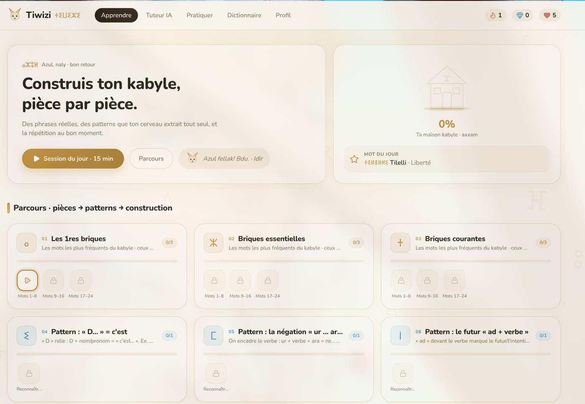
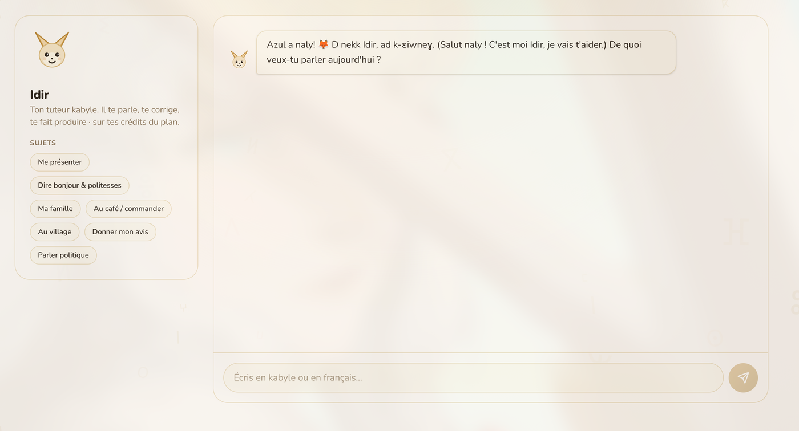

# tiwizi

Learning Kabyle (taqbaylit) for real, built on **verified human content** rather than the approximate Kabyle a language model invents.

> *tiwizi* is the Kabyle word for collective work done for the common good, the way a village helps one of its own build a house.



*The path: pieces, then patterns, then construction. Every unit unlocks the next.*



*Idir, the tutor: he speaks to you, corrects you, and makes you produce Kabyle.*

## The principle

Language models are bad at Kabyle: it is a low-resource language, they barely saw it in training, and they hallucinate it confidently. So tiwizi does not trust them with a single sentence. Every piece of content comes from real human sources.

- **208,000 real sentences** from [Tatoeba](https://tatoeba.org) (CC-BY), with audio.
- **The Dallet dictionary**, digitized: 12,500 entries with meanings, roots and examples ([DigitizedDallet](https://github.com/sferhah/DigitizedDallet), MIT).
- **Spaced repetition**: an SM-2 engine schedules your reviews, progress kept locally.
- **A cognitive session engine**: exercises built around patterns (induction, anticipation, judgment, generation) rather than flashcard drills.

## Stack

Next.js 16 (App Router), React 19, TypeScript, Tailwind 4. Data is served locally from `data/*.json`, search runs server-side through API routes.

## Run it

```bash
pnpm install
pnpm dev            # http://localhost:3000
```

## Rebuild the data

The JSON files are versioned in `data/`. To regenerate them from the sources:

```bash
bash scripts/build-data.sh
```

## Layout

```
app/            home, /session (cognitive engine), /lesson, /dictionary, /tutor, API
components/     exercise formats, navigation
lib/            cognitive-model, session-engine, patterns, srs, data
data/           patterns.json, pairs.json, deck.json, dict.json
scripts/        reproducible pipeline (build-patterns.mjs mines the patterns)
docs/           pedagogy, session and design notes
```

## Sources and licences

| Source | Content | Licence |
|--------|---------|---------|
| Tatoeba | sentences and audio | CC-BY 2.0 FR |
| DigitizedDallet | dictionary | MIT |

A language that survived by stubbornness deserves tools that do not lie about it.

More on [nabtiylan.com](https://nabtiylan.com/projects/tiwizi).
